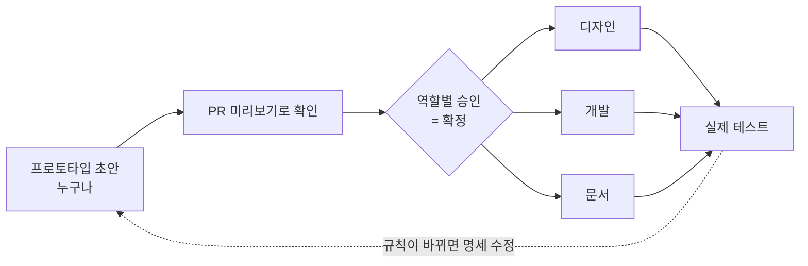

# prototype

**확정 전에는 실제 코드를 짜지 않는다.** 버리는 HTML 프로토타입과 명세로 기획을 먼저 확정하고,
확정된 다음에 기획·디자인·개발이 병렬로 진행한다. 이 레포는 그 방식을 실제로 돌려 보는 예시다.

👉 **확정본 목록: https://prototype.dotdotslash.me/**

## 왜

실제 코드 환경에서 프로토타이핑하면 DB까지 바뀌어 수정 공수가 크다. 피그마 와이어프레임 대신
AI로 만든 프로토타입으로 확정한다 — 화면은 눌러 보며 확인하고, 화면에 안 보이는 규칙(권한·상태 변화·숫자)은 명세에 적는다.

## 흐름

1. `prototypes/<기능>/`에 `index.html`(프로토타입)과 `SPEC.md`(명세)를 만든다.
2. PR을 올리면 미리보기 주소가 자동으로 생기고 PR에 코멘트로 달린다.
3. 기획·디자인·개발 담당이 각자 자기 쪽을 보고 Approve하면 확정이다. main에 머지된 것이 확정본이다.
4. 확정되면 디자인·개발·문서가 병렬로 진행한다. 규칙이 바뀌면 명세부터 고치고 다시 돈다.

## 원칙

- **명세가 정본이다.** 프로토타입과 명세가 어긋나면 명세를 따른다. 프로토타입은 버리는 코드다.
- 프로토타입은 정상 시나리오만 빠르게 만든다. 예외는 명세에 적고, 중요한 예외만 화면으로 추가한다.
- 프로토타입은 디자인 확정이 아니다. 디자인은 디자이너가 한다.
- 초안은 누구나 만든다. 디자이너나 기획자가 바빠도 진행이 멈추지 않는다.
- 명세 형식은 하나로 고정한다: **결정 · 권한 · 상태 변화 · 숫자 · 남은 질문**.

자세한 규칙은 [`AGENTS.md`](AGENTS.md). Claude Code에서는 `/prototype <slug> <설명>`으로 만들고 `/prototype-pr`로 올린다.

## 미리보기 구조

| 무엇 | 주소 |
|---|---|
| 확정본 목록 (main) | https://prototype.dotdotslash.me/ |
| PR 미리보기 목록 | `https://prototype.dotdotslash.me/pr-<번호>/` |
| PR 미리보기 한 건 | `https://prototype.dotdotslash.me/pr-<번호>/<slug>/` |

빌드가 없는 정적 HTML이라 GitHub Actions가 `gh-pages` 브랜치의 `pr-<번호>/`에 복사하고, PR이 닫히면 지운다
(`.github/workflows/preview.yml`). 목록 페이지는 각 `SPEC.md` 머리에서 자동으로 만든다.

> 사내에 들일 때는 같은 구조를 비공개 버킷 + 사내 IP·인증으로 막는 정적 호스팅(S3·CloudFront 등)으로 옮기면 된다.
> 파일 이름이 고정이라 캐시를 길게 걸면 고친 화면이 안 보인다 — 전부 no-cache로 올린다.

## 들어 있는 예시

전부 가짜 데이터로 만든 예시다.

| 폴더 | 무엇 |
|---|---|
| `fan-chat` | 버블형 팬 챗 — 방송인 1 → 멤버 N, 팬 답장은 방송인만 |
| `fan-letter` | 팬레터 — 받은 편지함과 방송 중 소개 |
| `stream-vote` | 다음 방송 투표 |
| `birthday-support` | 생일 서포트 — 포인트 모금과 미달 환불 |
| `highlight-vote` | 이번 주 하이라이트 클립 투표 |

## 참고

- Shopify는 디자이너의 약 60%가 코드를 직접 올리고, 사내 호스팅에 프로토타입이 5,500개 넘게 쌓여 있다. [Designer Fund](https://designerfund.substack.com/p/ai-design-shopify)
- Notion 디자인팀은 Claude Code로 만든 프로토타입을 공유 레포 하나에 모아서 쓴다. [Lenny's Newsletter](https://lennysnewsletter.com/p/this-week-on-how-i-ai-how-notions)
- Anthropic은 PM이 만든 프로토타입을 확정 후 Claude Code로 넘기는 흐름을 공식으로 소개한다. [Anthropic](https://www.anthropic.com/news/claude-design-anthropic-labs)
- 토스는 디자이너가 시안 대신 코드 레포를 개발팀에 넘긴 사례를 공개했다. [토스피드](https://toss.im/tossfeed/article/findyoursafezone-1b)
