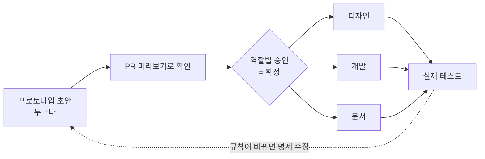

# prototype

**확정 전에는 실제 코드를 짜지 않는다.** 버리는 HTML 프로토타입과 명세로 기획을 먼저 확정하고,
확정된 다음에 기획·디자인·개발이 병렬로 진행한다. 이 레포는 그 방식을 실제로 돌려 보는 예시다.

👉 **확정본 목록: https://prototype.dotdotslash.me/** — 화면을 눌러 보고, "명세 읽기"로 규칙을 본다.

---

## 한눈에 보기



| 단계 | 누가 | 무엇을 | 결과물 |
|---|---|---|---|
| 1. 초안 | 누구나 | Claude와 함께 화면과 명세를 만든다 | `prototypes/<기능>/index.html` + `SPEC.md` |
| 2. 미리보기 | 자동 | PR을 올리면 주소가 생기고 PR에 코멘트로 달린다 | `prototype.dotdotslash.me/pr-<번호>/` |
| 3. 리뷰 | 기획·디자인·개발 | 각자 시간 날 때 열어 보고 코멘트를 남긴다 | PR 코멘트 · `SPEC.md` 수정 커밋 |
| 4. 확정 | 담당 셋 | 각자 Approve하면 머지한다 | main = 확정본 |
| 5. 병렬 진행 | 각자 | 디자인·개발·문서를 동시에 시작한다 | 실제 테스트까지 |

## 왜 이렇게 하나

- **실제 코드로 프로토타이핑하면 비싸다.** DB까지 같이 바뀌어서, 방향이 틀렸을 때 되돌리는 공수가 크다.
- **화면만으로는 규칙이 안 보인다.** 누가 무엇을 볼 수 있는지, 실패하면 어떻게 되는지, 숫자는 얼마인지는
  화면에 안 나온다. 그래서 화면과 명세를 같이 만든다.
- **초안은 누구나 만든다.** 디자이너나 기획자가 바빠도 진행이 멈추지 않는다. 피그마 와이어프레임 대신
  눌러 볼 수 있는 화면으로 확인한다.

---

## 처음 해 보는 사람을 위한 사용법

### 0. 준비

- 이 레포를 클론한다: `git clone https://github.com/Jeong-Jae-Hun/prototype.git`
- [Claude Code](https://claude.com/claude-code)(또는 비슷한 AI 코딩 도구)를 설치한다. 직접 HTML을 써도 되지만 훨씬 느리다.
- 레포 폴더에서 `claude`를 실행한다. 규칙 문서(`AGENTS.md`)는 자동으로 읽힌다.

### 1. 프로토타입 만들기

Claude Code에 이렇게 친다.

```
/prototype book-quiz 서점이 낸 책 퀴즈를 독자가 풀고 정답자에게 포인트를 주는 기능
```

- 앞의 `book-quiz`가 폴더 이름(영어 소문자·하이픈)이고, 뒤는 한 줄 설명이다.
- Claude가 브랜치를 만들고 템플릿을 복사한 뒤 **화면 → 명세** 순서로 채운다.
- 다 만들면 Claude가 "정해야 할 질문"을 보여 준다(예: 정답을 언제 공개하나, 틀리면 다시 풀 수 있나, 포인트는 누가 내나).
  아는 건 답하고, 모르는 건 "남은 질문으로 둬"라고 하면 된다.
- 로컬에서 보고 싶으면 `prototypes/book-quiz/index.html`을 브라우저로 열면 된다.

> 직접 만들고 싶으면 `prototypes/_templates/feature/`를 `prototypes/<이름>/`으로 복사해서 `index.html`과 `SPEC.md`를 고치면 된다.

### 2. PR 올리기

```
/prototype-pr
```

- Claude가 빠진 게 없는지 확인하고 PR을 올린다.
- **1~2분 뒤 PR에 미리보기 링크가 코멘트로 달린다.** 그 링크를 리뷰어에게 보내면 끝이다.
- 커밋을 더 올리면 미리보기도 저절로 갱신된다. (GitHub Pages 캐시 때문에 최대 10분 늦을 수 있다 — 안 바뀌면 강력 새로고침)

### 3. 리뷰하기 (리뷰어)

1. PR 코멘트의 미리보기 링크를 연다.
2. 화면 위쪽 **보기 전환 바**에서 역할(비로그인·독자·서점 사장님·운영자 등)·상태·브랜드·테마를 바꿔 가며 눌러 본다.
3. 같은 바의 **명세 읽기**로 규칙을 본다. 화면과 명세가 다르면 명세가 맞다.
4. 디자인 시스템·구조 PR이면 코멘트의 **화면 비교** 링크에서 달라진 화면이 의도한 것인지 본다.
5. 의견은 PR 코멘트로 남긴다.
   - 화면 의견("버튼 위치가 헷갈린다") → 코멘트만
   - 규칙 의견("탈퇴한 사람 표는 빼야 한다") → `SPEC.md`가 고쳐져야 한다. 작성자에게 요청하거나 직접 커밋한다.

### 4. 확정하기

명세 머리에 적힌 담당(기획·디자인·개발)이 각자 **Approve**하면 머지한다. 아래 셋이 다 맞아야 Approve한다.

- [ ] 권한 표에 빈칸이 없다
- [ ] 남은 질문마다 담당이 있거나 "구현을 막지 않음" 표시가 있다
- [ ] 화면과 명세가 어긋나지 않는다

머지되면 PR 미리보기는 지워지고, **확정본 목록(https://prototype.dotdotslash.me/)** 에 올라간다.

### 5. 확정 뒤

- 디자인은 확정된 화면을 디자인 시스템에 맞춰 다듬는다. 프로토타입은 디자인 확정이 아니다.
- 개발은 명세의 권한·상태 변화 표로 바로 착수한다. 화면 세부가 바뀌어도 규칙은 안 바뀌므로 디자인을 기다리지 않는다.
- **규칙이 바뀌면 `SPEC.md`부터 고치고** 다시 PR → 확정을 돈다. 코드나 디자인에서 먼저 바꾸면 다른 쪽이 옛 규칙으로 간다.

---

## 전체 구조·디자인 시스템도 여기서 정한다

기능 하나짜리 프로토타입만 있으면 "메뉴를 통째로 바꾸자", "버튼 색을 바꾸자" 같은 결정을 담을 자리가 없다.
그래서 프로토타입이 세 종류다.

| 종류 | 무엇을 정하나 | 어디서 |
|---|---|---|
| **기능** | 기능 하나의 화면과 규칙 | `prototypes/<기능>/` |
| **구조** | 앱 메뉴와 이동 — 모든 화면에 걸친다 | `prototypes/app-structure/` (앱 셸 `shell.js` + 사이트맵) |
| **디자인 시스템** | 색·간격·컴포넌트 — 모든 화면에 걸친다 | `prototypes/design-system/` (토큰·컴포넌트 + 갤러리) |

**모든 기능 화면이 디자인 시스템과 앱 셸을 가져다 쓴다.** 그래서 토큰 한 줄이나 메뉴 하나를 바꾸는 PR을 올리면
미리보기에서 **모든 화면이 새 모습으로** 다시 그려진다. 바뀐 걸 하나씩 열어 볼 필요도 없다 —
PR마다 **화면 비교**(main과 PR을 나란히 찍은 갤러리)가 자동으로 달린다.

> 여기서 정한 디자인 시스템·구조는 **제안**이다. 확정되면 제품 레포의 디자인 시스템에 반영한다.

### 앱 둘 × 라이트·다크

예시 서비스는 앱이 둘이다 — **책숲**(독자) · **책숲 파트너**(서점 사장님). 각각 라이트·다크 테마가 있다.

- 모든 화면 위쪽 보기 전환 바에서 **브랜드·테마**를 바꿔 볼 수 있다.
- 리뷰어에게 특정 조합을 보여 주려면 주소에 `?brand=partner&theme=dark`를 붙여 보낸다.
- 화면은 색을 직접 쓰지 않고 토큰만 쓴다. 그래서 네 벌에서 다 맞게 보이고, 화면 비교도 네 벌을 다 찍는다.

## 제품 현황과 공용 규칙 — `context/`

프로토타입 레포는 실제 제품 레포와 다른 저장소다. 그대로 두면 "이미 있는 것", "비싼 것", "못 바꾸는 것"을 모르고 화면을 그린다.
`context/`가 그 간극을 메운다.

| 파일 | 무엇 |
|---|---|
| [`context/features.md`](context/features.md) | 이미 있는 기능·역할 |
| [`context/constraints.md`](context/constraints.md) | 못 바꾸는 것·비싼 것·재사용할 것 |
| [`context/glossary.md`](context/glossary.md) | 용어집 — 같은 것을 같은 이름으로 |
| [`context/rules.md`](context/rules.md) | **모든 레포를 아우르는 공용 규칙** (개인정보·운영·화면·문구) |

- **정본은 바깥에 있다.** 제품 현황은 제품 레포가, 공용 규칙은 공용 규칙 레포가 소유하고, 바뀌면 이 레포로 자동 PR이 열린다.
  이 레포에서는 읽기만 한다. (예시라서 자동 PR은 없다 — 형태는 [`context/README.md`](context/README.md))
- 기능 명세에는 「기존 코드와의 관계」 절이 있다 — 재사용 · 신규 · 충돌. 개발 담당은 리뷰 때 이 절만 보고 비용을 판단한다.
- 규칙은 세 층이다: **공용 → 레포(`AGENTS.md`) → 폴더(`SPEC.md`)**. 좁은 쪽이 이기지만, 공용 규칙의 「항상」(개인정보·감사 등)은 덮을 수 없다.

---

## 명세(`SPEC.md`) 쓰는 법

형식은 하나로 고정한다. 순서도 바꾸지 않는다.

| 절 | 무엇을 쓰나 | 예 |
|---|---|---|
| **결정** | 정한 것과 이유. 하지 않기로 한 것도 | "단골은 하루 먼저 신청" · "현장 결제는 하지 않는다" |
| **권한** | 역할 × 행동 표. 빈칸 금지 | 비로그인은 모임 목록만 본다, 직원은 정산을 못 본다 |
| **상태 변화** | 상태와 전이, 되돌릴 수 있는지, 예외 흐름 | 모집 중 → 마감 → 모임 당일 → 종료, 취소되면? |
| **숫자** | 값과 "운영이 배포 없이 바꾸나" | 정원 12명 — 예 / 서점당 1개 — 아니오 |
| **기존 코드와의 관계** | 재사용·신규·충돌 (`context/` 근거) | 포인트 환불 API 재사용 · 노쇼 기록 신규 |
| **남은 질문** | 담당·기한·구현을 막는지 | "탈퇴한 사람 표는?" 기획 · 막음 |

- 구조·디자인 시스템은 형식이 조금 다르다 — `prototypes/_templates/<종류>/SPEC.md` 를 쓴다(화면 지도·이동 규칙 / 토큰·컴포넌트, 그리고 영향 받는 화면).
- 요금·정산 같은 사업 결정은 명세 작성 중에 정하지 않는다. 남은 질문으로 넘기고 최종 결정권자를 적는다.
- 화면에서 안 보이는 규칙이 대부분이다. Claude에게 "이 화면에서 안 보이는 규칙이 뭐야?"라고 물으면 잘 찾는다.

## 프로토타입 만들 때 지킬 것

- **정상 시나리오 하나**를 처음부터 끝까지 눌러 볼 수 있으면 충분하다. 예외는 명세에 적고, 중요한 것만 화면으로.
- **보기 전환 바**(역할·상태)를 붙인다. 리뷰어가 명세 표와 화면을 대조하는 장치다. 템플릿에 들어 있다(브랜드·테마 칸은 자동).
- 색은 `--ds-color-*` 토큰만, 버튼·카드는 `.ds-*` 컴포넌트만 쓴다. 새로 그리지 않는다.
- 숫자는 파일 위쪽 `NUM` 한 곳에. 서버 흉내는 내지 않는다(새로고침하면 처음으로).
- **실데이터 금지.** 이 레포와 미리보기는 공개다. 가짜 이름·가짜 숫자만.
- 꾸미지 않는다. 360px(모바일)과 1280px(데스크톱)에서 안 깨지면 된다.

---

## 들어 있는 예시

가상의 동네 책방 플랫폼 **책숲**(독자 앱)과 **책숲 파트너**(서점 사장님 앱)다. 전부 가짜 데이터다.

| 폴더 | 종류 | 무엇 |
|---|---|---|
| `design-system` | 디자인 시스템 | 두 앱 × 라이트·다크 토큰과 공용 컴포넌트 갤러리 |
| `app-structure` | 구조 | 두 앱의 탭 구조 — 모든 화면 위의 앱 셸 |
| `book-club` | 기능 | 북클럽 모임 — 독자는 신청, 사장님은 모임 열기 (두 앱에 걸친 기능) |
| `reading-challenge` | 기능 | 독서 챌린지 — 읽고 인증하면 포인트 |

**열려 있는 PR도 예시다** — 확정 전 리뷰 중인 모습을 그대로 둔다. [Pull requests](https://github.com/Jeong-Jae-Hun/prototype/pulls)에서 미리보기·화면 비교 링크를 볼 수 있다.

## 레포 구조

```
context/                  제품 현황·공용 규칙의 사본 (정본은 바깥 — 여기선 읽기만)
prototypes/
  _templates/             새 프로토타입의 출발점 — feature · structure · design-system
  design-system/          디자인 시스템 — tokens.css · components.css · theme.js + 갤러리
  app-structure/          구조 — shell.js(앱 셸) + 사이트맵
  <기능>/                 기능 하나 = 폴더 하나 (index.html + SPEC.md)
  spec.html               명세 뷰어 (SPEC.md 를 읽어 그린다)
scripts/
  hub.cjs                 목록 페이지 — SPEC.md 머리의 제목·종류·상태·브랜드·담당을 읽는다
  shots.cjs               화면 비교 — main 과 PR 을 브랜드 × 테마 × 폭으로 찍어 나란히
.github/workflows/        PR 미리보기 배포 (gh-pages 브랜치)
.claude/skills/           /prototype · /prototype-pr
AGENTS.md                 이 레포의 규칙 (AI 도구도 읽는다)
```

### 미리보기는 어떻게 돌아가나

빌드가 없는 정적 HTML이라 GitHub Actions가 `gh-pages` 브랜치의 `pr-<번호>/`에 그대로 복사하고, PR이 닫히면 지운다.
main에 머지되면 루트에 복사한다. 목록 페이지는 매번 각 `SPEC.md`에서 새로 만든다 — 손으로 목록을 고치지 않는다.
PR이면 Playwright가 main과 PR의 모든 화면을 찍어 `pr-<번호>/_shots/`에 비교 갤러리를 만든다.

> 사내에 들일 때는 같은 구조를 비공개 버킷 + 사내 IP·인증으로 막는 정적 호스팅(S3·CloudFront 등)으로 옮기면 된다.
> 파일 이름이 고정이라 캐시를 길게 걸면 고친 화면이 안 보인다 — 전부 no-cache로 올린다.

## 전제

- **명세가 정본**이라는 데 모두 동의해야 한다. 프로토타입은 버리는 코드다.
- 기능마다 기획·디자인·개발 담당이 정해져 있어야 한다. 끝까지 의견이 갈리는 사업 결정은 최종 결정권자를 따로 둔다.
- 모두가 Claude나 그에 준하는 도구를 쓸 수 있어야 한다.

## 참고

- Shopify는 디자이너의 약 60%가 코드를 직접 올리고, 사내 호스팅에 프로토타입이 5,500개 넘게 쌓여 있다. [Designer Fund](https://designerfund.substack.com/p/ai-design-shopify)
- Notion 디자인팀은 Claude Code로 만든 프로토타입을 공유 레포 하나에 모아서 쓴다. [Lenny's Newsletter](https://lennysnewsletter.com/p/this-week-on-how-i-ai-how-notions)
- Anthropic은 PM이 만든 프로토타입을 확정 후 Claude Code로 넘기는 흐름을 공식으로 소개한다. [Anthropic](https://www.anthropic.com/news/claude-design-anthropic-labs)
- 토스는 디자이너가 시안 대신 코드 레포를 개발팀에 넘긴 사례를 공개했다. [토스피드](https://toss.im/tossfeed/article/findyoursafezone-1b)
